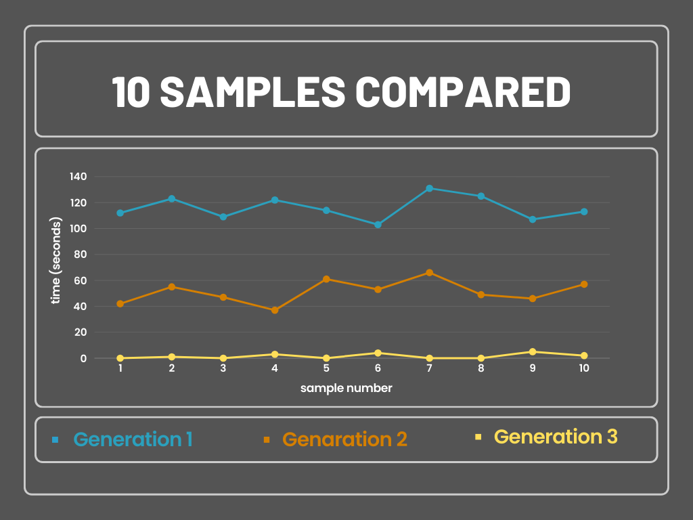

# Python Exercise: Array Speed and Performance Test 🚀


## Objective 🎯
Test the speed and array performance by implementing the following tasks:
- Create a random large array with some zeros.
- Move every zero to the end of the array.
- Ensure the code runs quickly.

## Code Output 🕒
- **Gen 1:**   113s
- **Gen 2:**   47s (2.4 times faster)
- **Gen 3:**   0.0118s (3983 times faster)
  
---



---

## Observations 🧐
- To no one's surprise, Python is not the fastest tool in the shed.
- There are clever ways of optimizing code.
- Even if Python is slow, we should carefully write code that is relatively optimized.


## How to Run 🏃‍♂️
1. Clone the repository.
2. Navigate to the project directory.
3. Run the Python script.

```bash
git clone https://github.com/34panda/array-zeros.git
cd array-zeros
python main.py
```

## Dependencies 📦
- Python 3.x

## License 📄
This project is licensed under the MIT License - see the [LICENSE](LICENSE) file for details.
